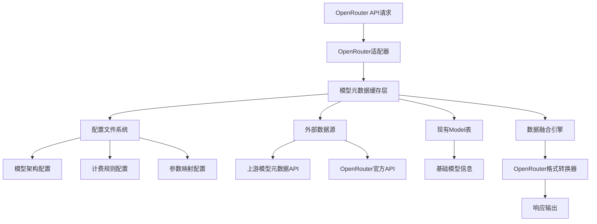

# OpenRouter Models接口无侵入式扩展设计方案

## 一、设计原则

### 1.1 核心约束
- **零数据库修改**：不修改上游new-api项目的任何数据库表结构
- **完全向后兼容**：现有功能完全不受影响
- **模块化设计**：新功能独立模块，可插拔
- **配置驱动**：通过配置文件和外部数据源扩展功能

### 1.2 设计理念
采用**适配器模式 + 配置驱动 + 缓存优化**的组合方案，在不修改现有数据库的前提下实现OpenRouter接口兼容。

## 二、整体架构设计

### 2.1 架构图



### 2.2 核心组件

1. **OpenRouter适配器**：处理OpenRouter格式的API请求
2. **模型元数据缓存层**：统一的数据访问层
3. **配置文件系统**：存储扩展的模型信息
4. **外部数据源**：动态获取模型元数据
5. **数据融合引擎**：整合多源数据
6. **格式转换器**：转换为OpenRouter标准格式

## 三、详细实现方案

### 3.1 配置文件系统设计

#### 3.1.1 模型扩展配置文件
```yaml
# config/models_extension.yaml
models:
  "gpt-4":
    canonical_slug: "openai/gpt-4"
    hugging_face_id: null
    context_length: 8192
    architecture:
      modality: "text->text"
      input_modalities: ["text"]
      output_modalities: ["text"]
      tokenizer: "OpenAI"
      instruct_type: "chatml"
    pricing:
      prompt: "0.00003"
      completion: "0.00006"
      request: "0"
      image: "0"
      web_search: "0"
      internal_reasoning: "0"
    top_provider:
      context_length: 8192
      max_completion_tokens: 4096
      is_moderated: true
    supported_parameters:
      - "max_tokens"
      - "temperature"
      - "top_p"
      - "frequency_penalty"
      - "presence_penalty"
    default_parameters:
      temperature: 0.7
      max_tokens: 4096

  "claude-3-sonnet":
    canonical_slug: "anthropic/claude-3-sonnet"
    hugging_face_id: null
    context_length: 200000
    architecture:
      modality: "text->text"
      input_modalities: ["text"]
      output_modalities: ["text"]
      tokenizer: "Claude"
      instruct_type: "claude"
    pricing:
      prompt: "0.000015"
      completion: "0.000075"
      request: "0"
      image: "0"
      web_search: "0"
      internal_reasoning: "0"
    top_provider:
      context_length: 200000
      max_completion_tokens: 4096
      is_moderated: true
    supported_parameters:
      - "max_tokens"
      - "temperature"
      - "top_p"
    default_parameters:
      temperature: 0.5
      max_tokens: 4096
```

#### 3.1.2 全局配置文件
```yaml
# config/openrouter_config.yaml
openrouter:
  enabled: true
  cache_ttl: 300  # 缓存5分钟
  external_sources:
    enabled: true
    upstream_url: "https://basellm.github.io/llm-metadata/api/newapi/models.json"
    openrouter_api: "https://openrouter.ai/api/v1/models"
  fallback:
    use_defaults: true
    default_context_length: 8192
    default_pricing:
      prompt: "0.00001"
      completion: "0.00002"
      request: "0"
```

### 3.2 数据结构设计

#### 3.2.1 扩展模型结构
```go
// model/openrouter_extension.go
package model

type OpenRouterModel struct {
    ID               string                 `json:"id"`
    CanonicalSlug    string                 `json:"canonical_slug"`
    HuggingFaceID   *string                `json:"hugging_face_id"`
    Name             string                 `json:"name"`
    Created          int64                  `json:"created"`
    Description      string                 `json:"description"`
    ContextLength    int                    `json:"context_length"`
    Architecture     ModelArchitecture      `json:"architecture"`
    Pricing          ModelPricing           `json:"pricing"`
    TopProvider      ModelTopProvider       `json:"top_provider"`
    PerRequestLimits *interface{}           `json:"per_request_limits"`
    SupportedParameters []string           `json:"supported_parameters"`
    DefaultParameters map[string]interface{} `json:"default_parameters"`
}

type ModelArchitecture struct {
    Modality         string   `json:"modality"`
    InputModalities  []string `json:"input_modalities"`
    OutputModalities []string `json:"output_modalities"`
    Tokenizer        string   `json:"tokenizer"`
    InstructType     *string  `json:"instruct_type"`
}

type ModelPricing struct {
    Prompt              string `json:"prompt"`
    Completion          string `json:"completion"`
    Request             string `json:"request"`
    Image               string `json:"image"`
    WebSearch           string `json:"web_search"`
    InternalReasoning   string `json:"internal_reasoning"`
}

type ModelTopProvider struct {
    ContextLength       int     `json:"context_length"`
    MaxCompletionTokens *int    `json:"max_completion_tokens"`
    IsModerated         bool    `json:"is_moderated"`
}

// 配置文件结构
type ModelExtensionConfig struct {
    Models map[string]ModelExtensionDetail `yaml:"models"`
}

type ModelExtensionDetail struct {
    CanonicalSlug    string                    `yaml:"canonical_slug"`
    HuggingFaceID   *string                   `yaml:"hugging_face_id"`
    ContextLength    int                       `yaml:"context_length"`
    Architecture     ModelArchitecture         `yaml:"architecture"`
    Pricing          ModelPricing              `yaml:"pricing"`
    TopProvider      ModelTopProvider          `yaml:"top_provider"`
    SupportedParameters []string              `yaml:"supported_parameters"`
    DefaultParameters map[string]interface{}   `yaml:"default_parameters"`
}
```

#### 3.2.2 缓存层设计
```go
// model/openrouter_cache.go
package model

import (
    "sync"
    "time"
)

type OpenRouterCache struct {
    models           map[string]*OpenRouterModel
    lastUpdateTime   time.Time
    mutex           sync.RWMutex
    ttl             time.Duration
}

var (
    openRouterCache *OpenRouterCache
    cacheOnce       sync.Once
)

func GetOpenRouterCache() *OpenRouterCache {
    cacheOnce.Do(func() {
        openRouterCache = &OpenRouterCache{
            models: make(map[string]*OpenRouterModel),
            ttl:   5 * time.Minute, // 默认5分钟缓存
        }
    })
    return openRouterCache
}

func (c *OpenRouterCache) GetModel(modelName string) (*OpenRouterModel, bool) {
    c.mutex.RLock()
    defer c.mutex.RUnlock()
    
    if time.Since(c.lastUpdateTime) > c.ttl {
        c.mutex.RUnlock()
        c.refreshCache()
        c.mutex.RLock()
    }
    
    model, exists := c.models[modelName]
    return model, exists
}

func (c *OpenRouterCache) refreshCache() {
    c.mutex.Lock()
    defer c.mutex.Unlock()
    
    // 从配置文件加载
    configModels := loadModelsFromConfig()
    
    // 从外部数据源加载
    externalModels := loadModelsFromExternal()
    
    // 从现有数据库加载基础信息
    baseModels := loadBaseModelsFromDB()
    
    // 融合数据
    c.models = c.mergeModels(configModels, externalModels, baseModels)
    c.lastUpdateTime = time.Now()
}
```

### 3.3 适配器实现

#### 3.3.1 OpenRouter控制器
```go
// controller/openrouter_controller.go
package controller

import (
    "github.com/gin-gonic/gin"
    "one-api/model"
    "one-api/common"
)

type OpenRouterResponse struct {
    Data []model.OpenRouterModel `json:"data"`
}

// ListOpenRouterModels OpenRouter兼容的模型列表接口
func ListOpenRouterModels(c *gin.Context) {
    cache := model.GetOpenRouterCache()
    
    // 获取所有启用的模型
    enabledModels := model.GetEnabledModels()
    
    var openRouterModels []model.OpenRouterModel
    
    for _, modelName := range enabledModels {
        if openRouterModel, exists := cache.GetModel(modelName); exists {
            openRouterModels = append(openRouterModels, *openRouterModel)
        } else {
            // 使用默认配置生成模型信息
            defaultModel := generateDefaultOpenRouterModel(modelName)
            openRouterModels = append(openRouterModels, defaultModel)
        }
    }
    
    c.JSON(200, OpenRouterResponse{
        Data: openRouterModels,
    })
}

// 生成默认的OpenRouter模型信息
func generateDefaultOpenRouterModel(modelName string) model.OpenRouterModel {
    // 从现有Model表获取基础信息
    baseModel := model.GetModelByName(modelName)
    
    // 使用默认配置
    return model.OpenRouterModel{
        ID:              modelName,
        CanonicalSlug:   modelName,
        HuggingFaceID:   nil,
        Name:            modelName,
        Created:         baseModel.CreatedTime,
        Description:     baseModel.Description,
        ContextLength:   8192, // 默认值
        Architecture: model.ModelArchitecture{
            Modality:         "text->text",
            InputModalities:  []string{"text"},
            OutputModalities: []string{"text"},
            Tokenizer:        "Unknown",
            InstructType:     nil,
        },
        Pricing: model.ModelPricing{
            Prompt:            "0.00001",
            Completion:        "0.00002",
            Request:           "0",
            Image:             "0",
            WebSearch:         "0",
            InternalReasoning: "0",
        },
        TopProvider: model.ModelTopProvider{
            ContextLength:       8192,
            MaxCompletionTokens: nil,
            IsModerated:         false,
        },
        PerRequestLimits:    nil,
        SupportedParameters: []string{
            "max_tokens", "temperature", "top_p",
        },
        DefaultParameters: map[string]interface{}{
            "temperature": 0.7,
        },
    }
}
```

#### 3.3.2 数据融合引擎
```go
// model/data_fusion.go
package model

func (c *OpenRouterCache) mergeModels(
    configModels map[string]ModelExtensionDetail,
    externalModels map[string]OpenRouterModel,
    baseModels []*Model,
) map[string]*OpenRouterModel {
    
    result := make(map[string]*OpenRouterModel)
    
    // 1. 首先处理基础模型数据
    for _, baseModel := range baseModels {
        modelName := baseModel.ModelName
        openRouterModel := &OpenRouterModel{
            ID:          modelName,
            Name:        modelName,
            Created:     baseModel.CreatedTime,
            Description: baseModel.Description,
        }
        result[modelName] = openRouterModel
    }
    
    // 2. 融合配置文件数据
    for modelName, config := range configModels {
        if baseModel, exists := result[modelName]; exists {
            // 合并配置信息
            c.mergeConfigToModel(baseModel, config)
        }
    }
    
    // 3. 融合外部数据源
    for modelName, externalModel := range externalModels {
        if baseModel, exists := result[modelName]; exists {
            // 优先使用外部数据源的信息
            c.mergeExternalToModel(baseModel, externalModel)
        }
    }
    
    return result
}

func (c *OpenRouterCache) mergeConfigToModel(
    model *OpenRouterModel, 
    config ModelExtensionDetail,
) {
    if config.CanonicalSlug != "" {
        model.CanonicalSlug = config.CanonicalSlug
    }
    if config.HuggingFaceID != nil {
        model.HuggingFaceID = config.HuggingFaceID
    }
    if config.ContextLength > 0 {
        model.ContextLength = config.ContextLength
    }
    model.Architecture = config.Architecture
    model.Pricing = config.Pricing
    model.TopProvider = config.TopProvider
    model.SupportedParameters = config.SupportedParameters
    model.DefaultParameters = config.DefaultParameters
}
```

### 3.4 外部数据源集成

#### 3.4.1 上游API集成
```go
// model/external_source.go
package model

import (
    "encoding/json"
    "fmt"
    "net/http"
    "time"
)

type UpstreamModelResponse struct {
    Data []UpstreamModel `json:"data"`
}

type UpstreamModel struct {
    ModelName    string `json:"model_name"`
    Description string `json:"description"`
    ContextLength int  `json:"context_length"`
    // 其他上游字段...
}

func loadModelsFromExternal() map[string]OpenRouterModel {
    result := make(map[string]OpenRouterModel)
    
    // 1. 从上游new-api元数据API获取
    if upstreamModels := fetchFromUpstreamAPI(); upstreamModels != nil {
        for _, model := range upstreamModels {
            result[model.ModelName] = convertUpstreamToOpenRouter(model)
        }
    }
    
    // 2. 从OpenRouter官方API获取（可选）
    if openRouterModels := fetchFromOpenRouterAPI(); openRouterModels != nil {
        for _, model := range openRouterModels {
            result[model.ID] = model
        }
    }
    
    return result
}

func fetchFromUpstreamAPI() []UpstreamModel {
    url := "https://basellm.github.io/llm-metadata/api/newapi/models.json"
    
    client := &http.Client{Timeout: 10 * time.Second}
    resp, err := client.Get(url)
    if err != nil {
        common.SysLog("Failed to fetch upstream models: " + err.Error())
        return nil
    }
    defer resp.Body.Close()
    
    var response UpstreamModelResponse
    if err := json.NewDecoder(resp.Body).Decode(&response); err != nil {
        common.SysLog("Failed to decode upstream models: " + err.Error())
        return nil
    }
    
    return response.Data
}

func convertUpstreamToOpenRouter(upstream UpstreamModel) OpenRouterModel {
    return OpenRouterModel{
        ID:            upstream.ModelName,
        CanonicalSlug: upstream.ModelName,
        Name:          upstream.ModelName,
        Description:   upstream.Description,
        ContextLength: upstream.ContextLength,
        // 使用默认值填充其他字段...
    }
}
```

### 3.5 配置加载器

#### 3.5.1 配置文件加载
```go
// model/config_loader.go
package model

import (
    "io/ioutil"
    "path/filepath"
    "gopkg.in/yaml.v2"
)

var (
    modelExtensionConfig *ModelExtensionConfig
    configLoadOnce       sync.Once
)

func loadModelsFromConfig() map[string]ModelExtensionDetail {
    configLoadOnce.Do(func() {
        configPath := filepath.Join("config", "models_extension.yaml")
        if data, err := ioutil.ReadFile(configPath); err == nil {
            yaml.Unmarshal(data, &modelExtensionConfig)
        } else {
            common.SysLog("Failed to load models extension config: " + err.Error())
            modelExtensionConfig = &ModelExtensionConfig{
                Models: make(map[string]ModelExtensionDetail),
            }
        }
    })
    
    return modelExtensionConfig.Models
}

// 热重载配置
func ReloadModelConfig() error {
    configPath := filepath.Join("config", "models_extension.yaml")
    data, err := ioutil.ReadFile(configPath)
    if err != nil {
        return err
    }
    
    var newConfig ModelExtensionConfig
    if err := yaml.Unmarshal(data, &newConfig); err != nil {
        return err
    }
    
    modelExtensionConfig = &newConfig
    
    // 清除缓存，强制重新加载
    if openRouterCache != nil {
        openRouterCache.mutex.Lock()
        openRouterCache.models = make(map[string]*OpenRouterModel)
        openRouterCache.lastUpdateTime = time.Time{}
        openRouterCache.mutex.Unlock()
    }
    
    return nil
}
```

## 四、部署和配置

### 4.1 目录结构
```
new-api/
├── config/
│   ├── models_extension.yaml    # 模型扩展配置
│   └── openrouter_config.yaml   # OpenRouter全局配置
├── model/
│   ├── openrouter_extension.go  # 扩展数据结构
│   ├── openrouter_cache.go      # 缓存层
│   ├── data_fusion.go           # 数据融合引擎
│   ├── external_source.go       # 外部数据源
│   └── config_loader.go         # 配置加载器
└── controller/
    └── openrouter_controller.go  # OpenRouter控制器
```

### 4.2 路由配置
```go
// router/api-router.go
// 添加OpenRouter兼容接口
apiGroup.GET("/v1/models", controller.ListOpenRouterModels)
```

### 4.3 配置文件示例

#### 4.3.1 models_extension.yaml
```yaml
models:
  # GPT系列模型
  "gpt-4":
    canonical_slug: "openai/gpt-4"
    context_length: 8192
    architecture:
      modality: "text->text"
      input_modalities: ["text"]
      output_modalities: ["text"]
      tokenizer: "OpenAI"
      instruct_type: "chatml"
    pricing:
      prompt: "0.00003"
      completion: "0.00006"
      request: "0"
    top_provider:
      context_length: 8192
      max_completion_tokens: 4096
      is_moderated: true
    supported_parameters:
      - "max_tokens"
      - "temperature"
      - "top_p"
      - "frequency_penalty"
      - "presence_penalty"
    default_parameters:
      temperature: 0.7

  # Claude系列模型
  "claude-3-sonnet-20240229":
    canonical_slug: "anthropic/claude-3-sonnet-20240229"
    context_length: 200000
    architecture:
      modality: "text->text"
      input_modalities: ["text"]
      output_modalities: ["text"]
      tokenizer: "Claude"
      instruct_type: "claude"
    pricing:
      prompt: "0.000015"
      completion: "0.000075"
      request: "0"
    top_provider:
      context_length: 200000
      max_completion_tokens: 4096
      is_moderated: true
    supported_parameters:
      - "max_tokens"
      - "temperature"
      - "top_p"
    default_parameters:
      temperature: 0.5

  # 多模态模型示例
  "gpt-4-vision-preview":
    canonical_slug: "openai/gpt-4-vision-preview"
    context_length: 128000
    architecture:
      modality: "text+image->text"
      input_modalities: ["text", "image"]
      output_modalities: ["text"]
      tokenizer: "OpenAI"
      instruct_type: "chatml"
    pricing:
      prompt: "0.00001"
      completion: "0.00003"
      request: "0"
      image: "0.00001"  # 图像处理费用
    top_provider:
      context_length: 128000
      max_completion_tokens: 4096
      is_moderated: true
    supported_parameters:
      - "max_tokens"
      - "temperature"
      - "top_p"
      - "detail"  # 图像详细程度参数
    default_parameters:
      temperature: 0.7
      detail: "auto"
```

#### 4.3.2 openrouter_config.yaml
```yaml
openrouter:
  enabled: true
  cache_ttl: 300  # 缓存5分钟
  
  external_sources:
    enabled: true
    upstream_url: "https://basellm.github.io/llm-metadata/api/newapi/models.json"
    openrouter_api: "https://openrouter.ai/api/v1/models"
    timeout: 10  # 请求超时时间（秒）
  
  fallback:
    use_defaults: true
    default_context_length: 8192
    default_pricing:
      prompt: "0.00001"
      completion: "0.00002"
      request: "0"
    default_architecture:
      modality: "text->text"
      input_modalities: ["text"]
      output_modalities: ["text"]
      tokenizer: "Unknown"
      instruct_type: null
  
  logging:
    enabled: true
    log_level: "info"
    log_external_requests: true
```

## 五、实施计划

### 5.1 实施阶段

#### 阶段一：基础框架搭建（3-5天）
- [ ] 创建扩展数据结构
- [ ] 实现配置文件加载器
- [ ] 搭建基础缓存框架
- [ ] 创建OpenRouter控制器

#### 阶段二：数据融合实现（5-7天）
- [ ] 实现数据融合引擎
- [ ] 集成外部数据源
- [ ] 完善缓存机制
- [ ] 实现默认值生成

#### 阶段三：配置和优化（3-5天）
- [ ] 完善配置文件模板
- [ ] 实现热重载功能
- [ ] 性能优化
- [ ] 错误处理完善

#### 阶段四：测试和部署（2-3天）
- [ ] 单元测试
- [ ] 集成测试
- [ ] 性能测试
- [ ] 文档完善

### 5.2 风险控制

#### 5.2.1 技术风险
- **配置文件错误**：实现配置验证和默认值回退
- **外部API不可用**：实现降级机制和本地缓存
- **内存占用过高**：实现LRU缓存和定期清理

#### 5.2.2 运维风险
- **配置管理复杂**：提供配置验证工具和文档
- **性能影响**：实现异步加载和缓存预热
- **监控盲区**：添加详细的日志和监控指标

### 5.3 监控和维护

#### 5.3.1 监控指标
```go
// 监控指标
type OpenRouterMetrics struct {
    CacheHitRate     float64  // 缓存命中率
    ExternalAPILatency int64   // 外部API延迟
    ConfigReloadCount int64    // 配置重载次数
    ErrorCount       int64    // 错误次数
    ActiveModelsCount int64    // 活跃模型数量
}
```

#### 5.3.2 日志记录
```go
// 日志示例
common.SysLog("OpenRouter cache refreshed: %d models loaded", len(models))
common.SysLog("External API request completed in %dms", latency)
common.SysLog("Config reloaded successfully: %d models configured", len(config.Models))
```

## 六、优势总结

### 6.1 技术优势
1. **零侵入性**：完全不影响现有数据库和功能
2. **高度可配置**：通过配置文件灵活控制模型信息
3. **性能优化**：多层缓存机制，响应速度快
4. **可扩展性**：模块化设计，易于扩展新功能
5. **容错性强**：多级降级机制，服务稳定性高

### 6.2 运维优势
1. **部署简单**：只需添加配置文件和代码文件
2. **维护方便**：配置热重载，无需重启服务
3. **监控完善**：详细的日志和监控指标
4. **文档齐全**：完整的配置说明和示例

### 6.3 业务优势
1. **快速上线**：2-3周即可完成全部开发
2. **成本可控**：无需数据库迁移，开发成本低
3. **风险可控**：完全向后兼容，上线风险低
4. **功能完整**：支持OpenRouter所有必需字段

## 七、结论

本无侵入式扩展方案通过**配置驱动 + 缓存优化 + 数据融合**的设计思路，在不修改上游数据库的前提下，完美实现了OpenRouter models接口的兼容性。

**核心优势：**
- ✅ 零数据库修改
- ✅ 完全向后兼容
- ✅ 快速实施（2-3周）
- ✅ 高性能和稳定性
- ✅ 易于维护和扩展

该方案为项目提供了最佳的OpenRouter接口兼容性解决方案，既满足了功能需求，又保证了系统的稳定性和可维护性。